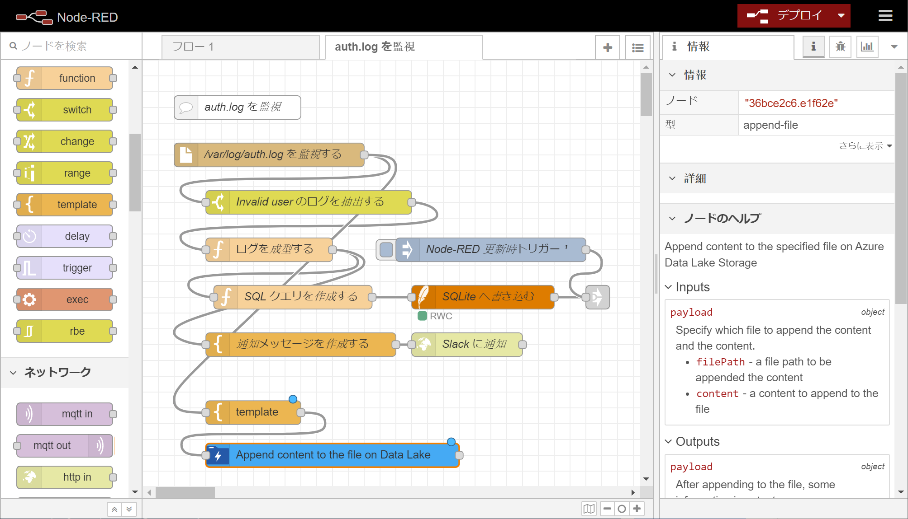

# Node-RED example to monitor log

This is an example to monitor a log file on Linux with Node-RED. While monitoring the log file, if detect invalid log then notify on Slack. Also, you can see the logs on Node-RED UI dashboard.

If you want to record the logs outside of the server machine, I'll show you how to upload the data to [Azure Data Lake Storage](https://azure.microsoft.com/en-us/services/storage/data-lake-storage/) at [Advanced example](#advanced%20example).

## Basic example

### Environment overview

- Ubuntu 18.04 LTS
  - Open 1880 port
- Node.js LTS 12.x (v12.16.2)
  - [Debian and Ubuntu based Linux distributions | Installing Node.js via package manager | Node.js](https://nodejs.org/en/download/package-manager/#debian-and-ubuntu-based-linux-distributions)
- Node-RED (v1.0.5)
  - [Node-RED : Installation](https://nodered.org/docs/getting-started/installation)
- SQLite
  - [Command Line Shell For SQLite](http://sqlite.org/cli.html)

### Prepare the environment

Install Node-RED and SQLite command, that is used to record the log to display the status on the dashboard.

```bash
# Install Node.js
curl -sL https://deb.nodesource.com/setup_12.x | sudo -E bash -
sudo apt-get install -y nodejs

# Install Node-RED
sudo npm install -g --unsafe-perm node-red

# install SQLite command
sudo apt-get install sqlite
```

Then prepare the database on SQLite.

```bash
# Create a directory for the db file and change owner to yours
sudo mkdir /usr/local/etc/sqlite3
sudo chown <you>:<your group> /usr/local/etc/sqlite3/

# Create a db file and initialize it
sqlite3 /usr/local/etc/sqlite3/monitor-logs.db

sqlite> CREATE TABLE invalid_users (timestamp TIMESTAMP NOT NULL PRIMARY KEY, user VARCHAR(32) NOT NULL, address_from VARCHAR(15) NOT NULL);
sqlite> .exit
```

### Prepare on Node-RED

Run Node-RED.

```bash
# Run Node-RED
node-red
```

Access to the Node-RED editor by opening `http://<your server IP>:1880` in a web browser.

Open "Manage palette" from a menu placed on the right top and install packages below at the "Install" tab.

- node-red-node-sqlite
- node-red-dashboard

Then, open "Import" from the menu and open "Clipboard" tab, paste JSON that is written on [`flow.json`](./flow.json) and click "Import" button to load the flow.

### Prepare slack notification

Configure Incomming WebHooks in Slack. For details, see https://api.slack.com/messaging/webhooks.

After configured Incomming WebHooks, set the WebHook URL to the flow.

1. Open the property of "Slack に通知" node, set the Slack WebHook URL to `URL` field and close it.
2. Open the property of "通知メッセージを作成する" node, customize the template. (`http://localhost:1880/ui/` is a Node-RED Dashboard's URL. Please confirm the URL for your environment.)

```json
{
    "text": "Attacked from `{{ payload.address_from }}` as `{{ payload.user }}` !",
    "attachments": [
        {
            "fallback": "Click <http://localhost:1880/ui/|here> to see detail.",
            "actions": [
                {
                    "type": "button",
                    "text": "See all :thinking_face:",
                    "url": "http://localhost:1880/ui/"
                }
            ]
        }
    ]
}
```

Then, deploy and run it.

## Advanced example

I show how to send the data to Azure Data Lake with the flow above.

### Prerequisites

- You should have an enviroment above
- Azure account
  If you don't have an account yet, you can create it free. See [here](https://azure.microsoft.com/en-us/free/).

### Deploy Azure resources

See [Azure Data Lake Storage の準備](./docs/prepare-azure-data-lake-storage_ja.md). (Sorry, this is Japanese description only.)

### Update your flow with `node-red-contrib-azure-data-lake-storage`

Add the node `node-red-contrib-azure-data-lake-storage` with a template node, and place the node like below.



Open the property of the tempalte node, set a following template JSON.

```json
{
  "filePath": "auth.log",
  "content": "{{ payload }}"
}
```

Open the property of the `node-red-contrib-azure-data-lake-storage` node, set properties like `Storage Account Name`, `Storage Account Key`, `File system(Container name)`.

Then deploy and run it.
