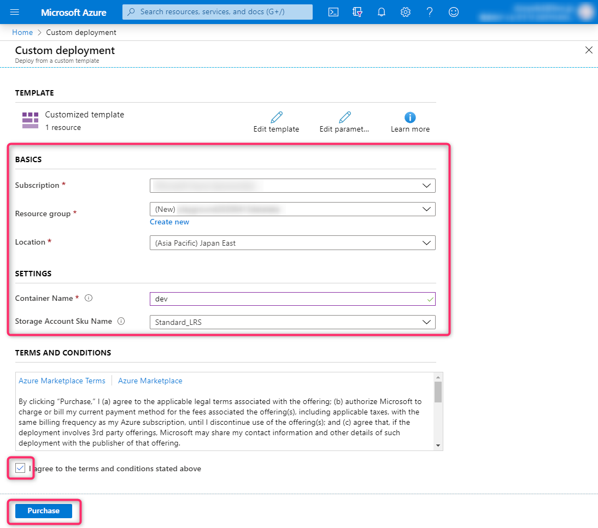
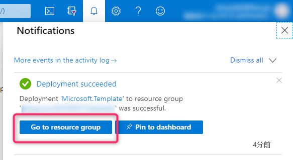
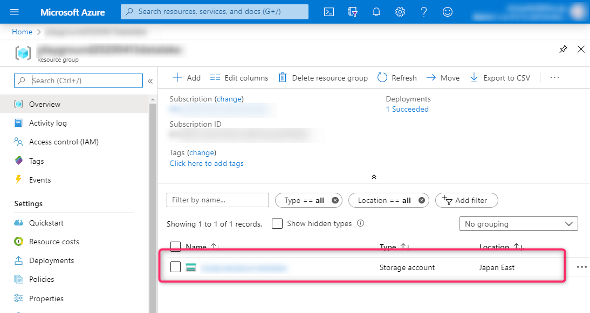
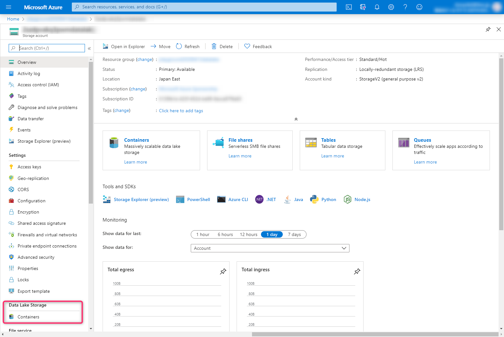
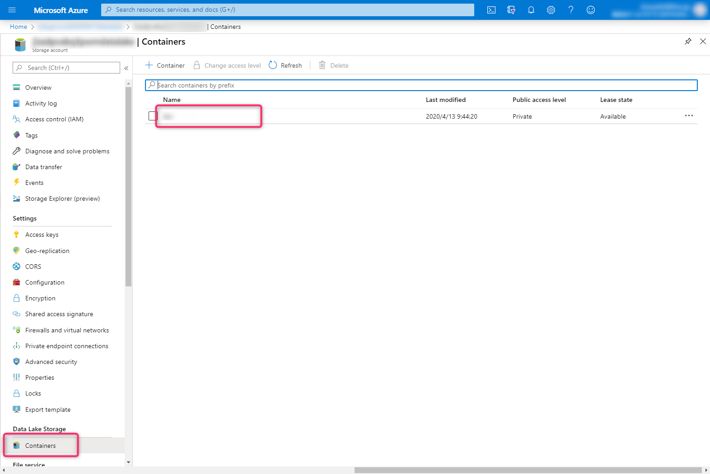
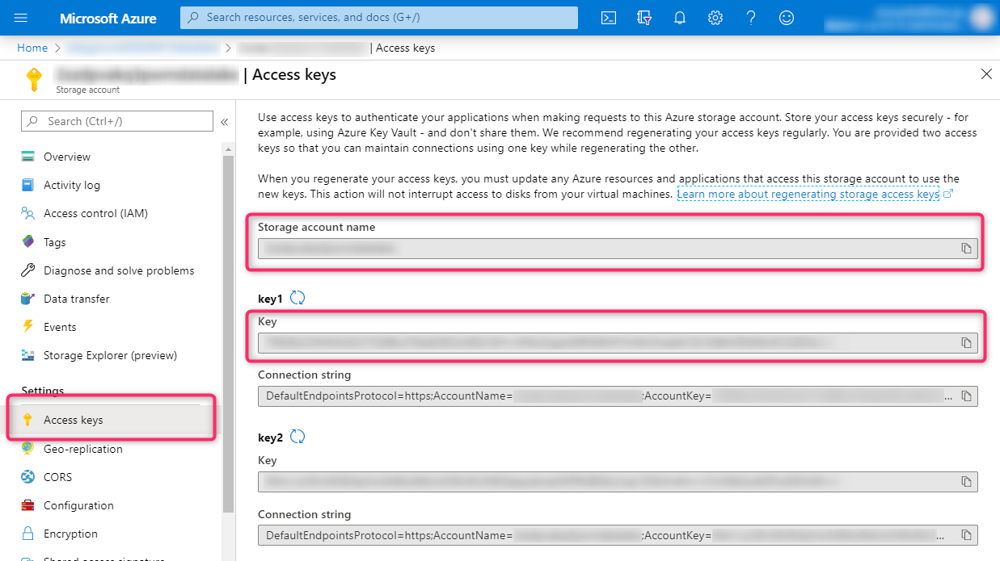

# Azure Data Lake Storage の準備

Azure Data lake Storage をデプロイし、接続情報を取得する手順を記載します。

## Azure アカウントの準備

Azureアカウントをまだお持ちでない方は、下記のページから無料枠を含めたAzureアカウントを作成することができます。

- [Azure の無料アカウントを今すぐ作成しましょう | Microsoft Azure](https://azure.microsoft.com/ja-jp/free/)

## Azure Data Lake Storage の準備

Azure Data Lake Storage は、Azure Storage account の一部の機能です。ここでは、 Data Lake Storage 機能を有効にした Storage account をデプロイする方法を紹介します。

### Azure ポータルを利用する場合

下記のボタンをクリックすると、Azureポータルが開きます。

[](https://portal.azure.com/#create/Microsoft.Template/uri/https%3A%2F%2Fraw.githubusercontent.com%2Fdzeyelid%2Fnode-red-example-monitor-server-log%2Fmaster%2Farm-templates%2Fdata-lake-storage.json)

各フィールドを入力し、「Purchase」ボタンをクリックしデプロイしましょう。



デプロイが完了すると、下記のような通知が表示されます。（消えてしまった場合は、画面右上のベルのアイコンをクリックして通知領域を表示してください。）

「Go to resource group」ボタンをクリックし、リソースグループに移動します。



リソースグループに移動すると、リソースの一覧が表示されています。その中の Storage account に移動しましょう。



通常の Storage account とほとんど同じ見た目ですが、左のメニューに「Data Lake Storage」という項目があり、「Container」があることがわかります。



### Azure CLI を利用する場合

Azure CLI でもデプロイすることができます。後述の接続情報の取得もふくめ、こちらの方が少ない手数で作業をすることができます。

Azure CLI をまだお持ちでない場合は、[こちら](https://docs.microsoft.com/ja-jp/cli/azure/install-azure-cli?view=azure-cli-latest) を参考にインストールしてください。

```bash
RESOURCE_GROUP=<Resource group name>
LOCATION=japaneast
CONTAINER_NAME=<Container name>

az group create --name $RESOURCE_GROUP --location $LOCATION

az group deployment create \
    --resource-group $RESOURCE_GROUP \
    --handle-extended-json-format \
    --template-file ./arm-templates/data-lake-storage.json \
    --parameters \
        containerName=$CONTAINER_NAME \
    --query "properties.outputs"
```

デプロイが終わると下記のように、 `containerName`, `storageAccountKey`, `storageAccountName` が出力されます。

```json
{
  "containerName": {
    "type": "String",
    "value": "<A container name that you specified>"
  },
  "storageAccountKey": {
    "type": "String",
    "value": "<A key of deployed storage account>"
  },
  "storageAccountName": {
    "type": "String",
    "value": "<deployed storage account name>"
  }
}
```

## 接続情報の取得

Azure Data Lake Storage へ接続する際に必要になる「Storage Account Name」「Storage Account Key」「File system(Container name)」の取得について記載します。

### Azure ポータルでデプロイした場合

Storage account の画面で、メニューから「Data Lake Storage」の「Containers」を開くと、コンテナ一覧が表示されます。

このコンテナが「File system(Container name)」です。



また、メニューから「Access keys」を開くと、「Storage Account Name」「Storage Account Key」を確認することができます。



### Azure CLI でデプロイした場合

Azure CLI の `az group deployment create` でデプロイした場合は、実行後に表示されたJSONに接続情報が含まれています。

| 項目 | `az group deployment create` の実行結果(JSON)の該当箇所 |
|----|----|
| Storage Account Name | `storageAccountName.value` |
| Storage Account Key | `storageAccountKey.value` |
| File system(Container name) | `containerName.value` |